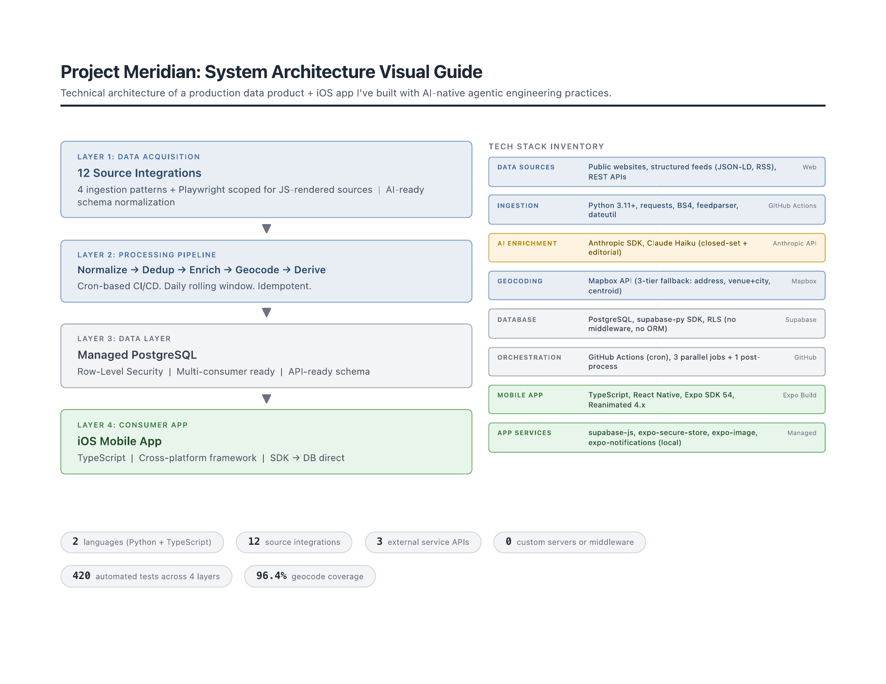
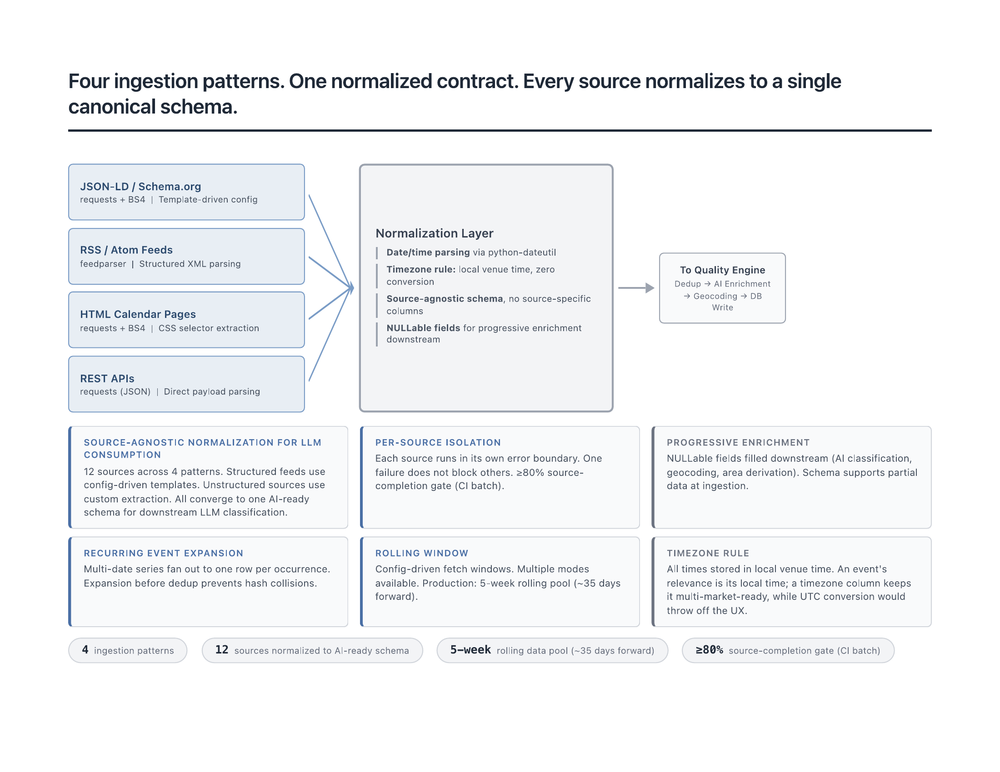
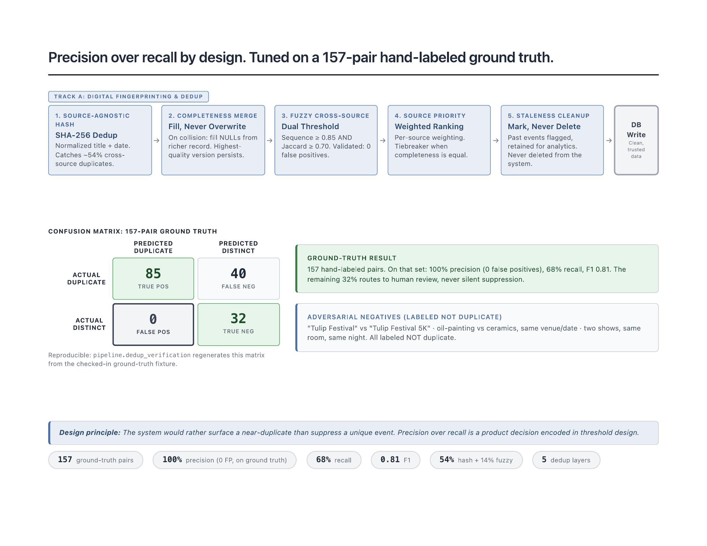
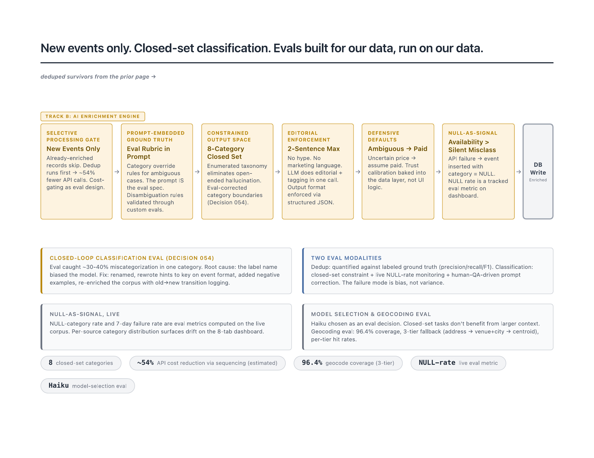
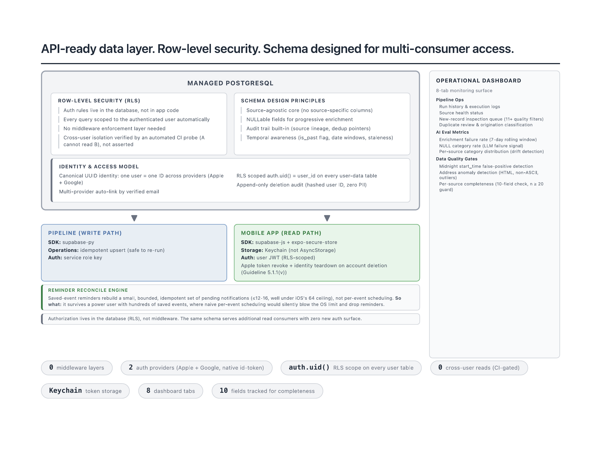
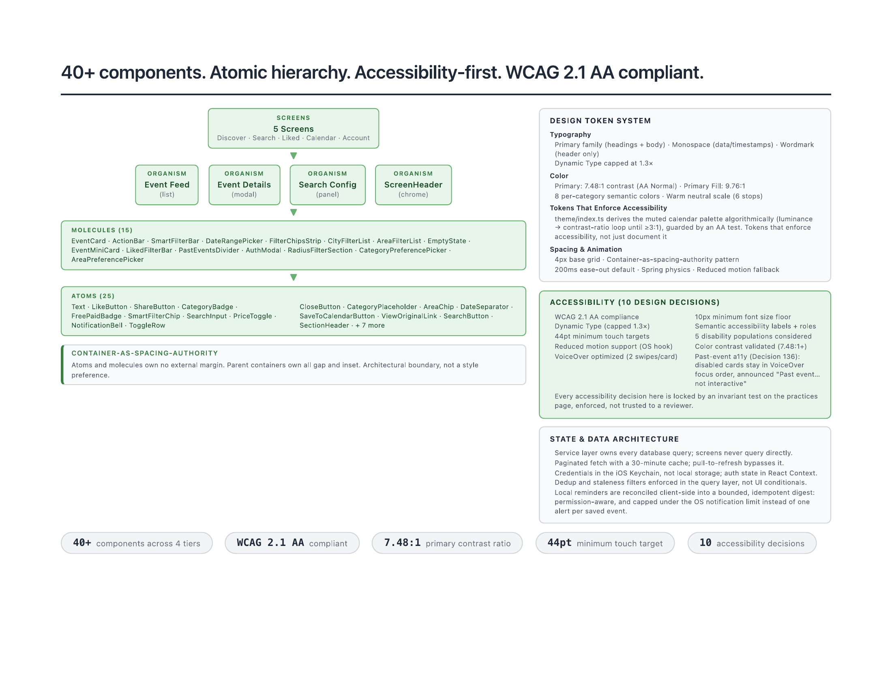
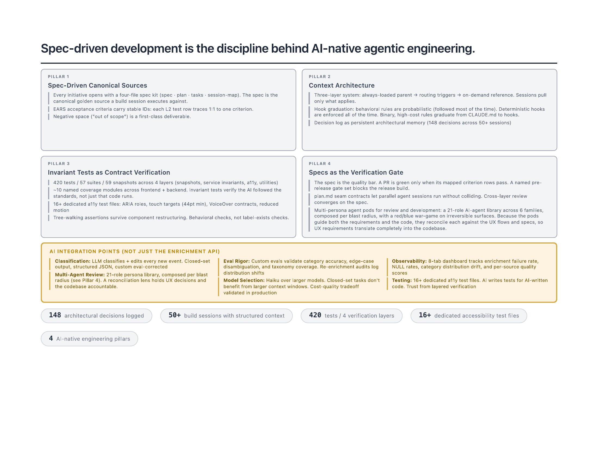

# Project Meridian: System Architecture Visual Guide

## System Architecture & Tech Stack

<picture>
  <source media="(prefers-color-scheme: dark)" srcset="images/page-1-dark.png">
  
</picture>

## Data Ingestion Pipeline

<picture>
  <source media="(prefers-color-scheme: dark)" srcset="images/page-2-dark.png">
  
</picture>

## Deduplication & Precision Engineering

<picture>
  <source media="(prefers-color-scheme: dark)" srcset="images/page-3-dark.png">
  
</picture>

## AI Enrichment & Custom Evals

<picture>
  <source media="(prefers-color-scheme: dark)" srcset="images/page-4-dark.png">
  
</picture>

## Database & API Contract Design

<picture>
  <source media="(prefers-color-scheme: dark)" srcset="images/page-5-dark.png">
  
</picture>

## Frontend Architecture & Design System

<picture>
  <source media="(prefers-color-scheme: dark)" srcset="images/page-6-dark.png">
  
</picture>

## AI-Native Engineering Practices

<picture>
  <source media="(prefers-color-scheme: dark)" srcset="images/page-7-dark.png">
  
</picture>
