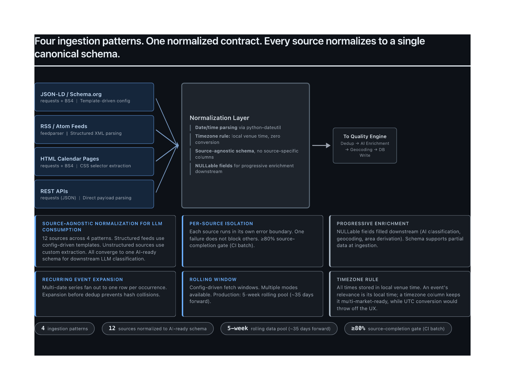
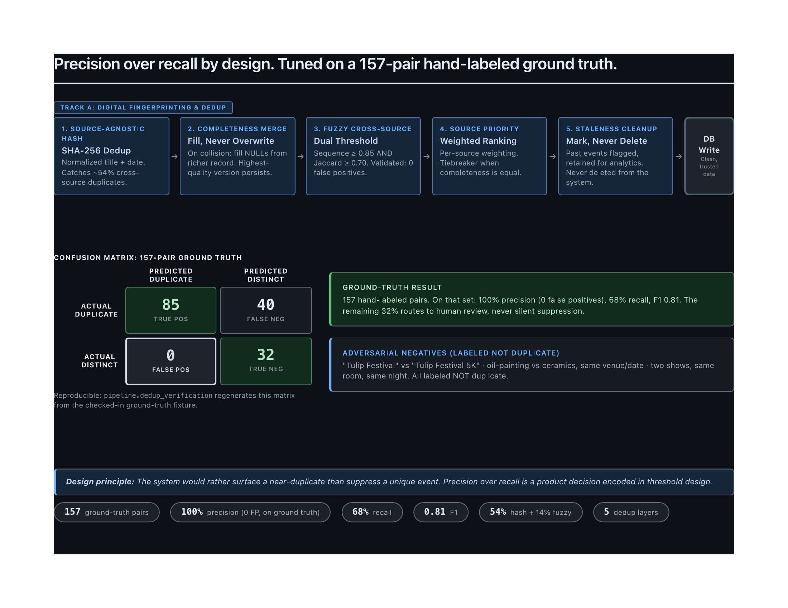
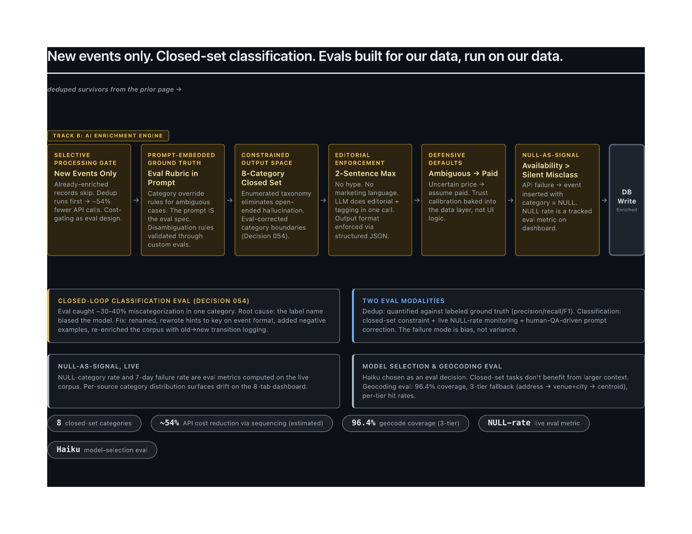
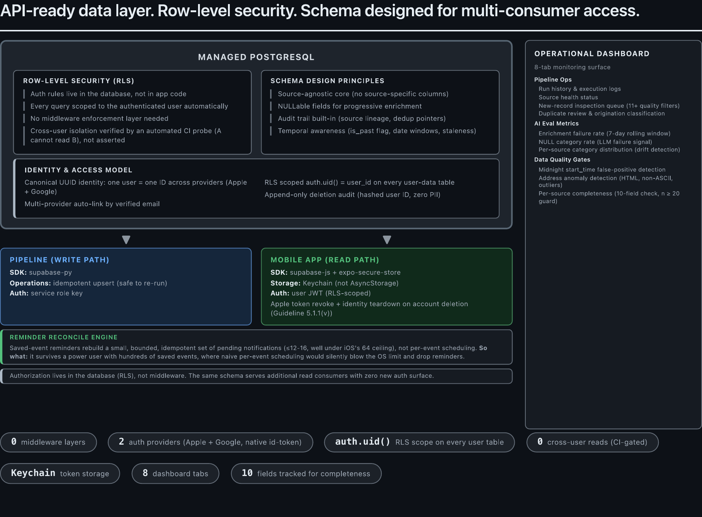
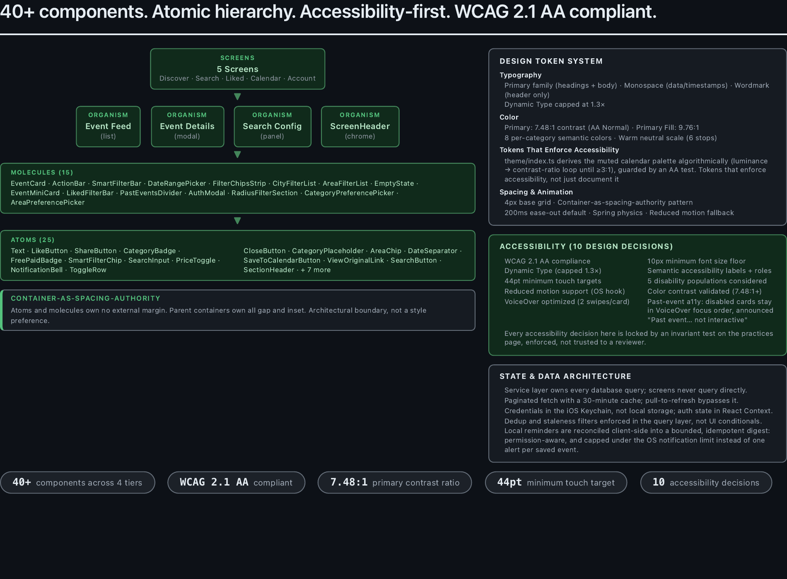
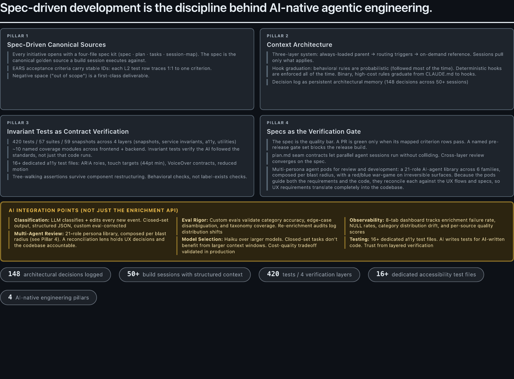

# Project Meridian: System Architecture Visual Guide

## System Architecture & Tech Stack

## Data Ingestion Pipeline

## Deduplication & Precision Engineering

## AI Enrichment & Custom Evals

## Database & API Contract Design

## Frontend Architecture & Design System

## AI-Native Engineering Practices

